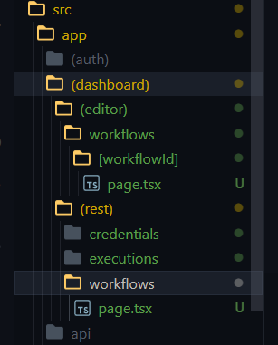

the reason we have separated the workflows like this is because all the routes inside the (rest) have the same layout but the worflows/:workflowId will have completely different layout

for /workflows route we can only have page.tsx in any one of the folder. if we add in both the /workflows folder it will cause conflict for a same route